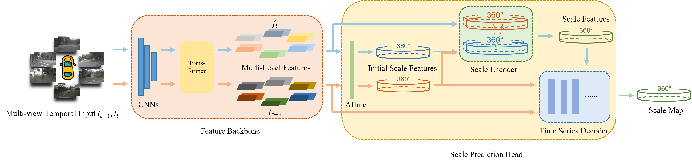
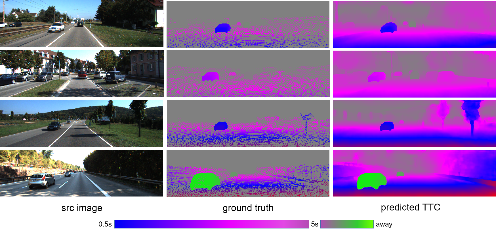

# FP-TTC: Fast Prediction of Time-to-Collision using Monocular Images

Official implementation of "FP-TTC: Fast Prediction of Time-to-Collision using Monocular Images". Submitted to T-CSVT on May **, 2024.




## Abstract

**Time-to-Collision (TTC)** is a measure of the time until an object collides with the observation plane which is a critical input indicator for obstacle avoidance and other downstream modules. Previous works have utilized deep neural networks to estimate TTC with monocular cameras in an end-toend manner, which obtain the state-of-the-art (SOTA) accuracy performance. However, these models usually have deep layers and numerous parameters, resulting in long inference time and high computational overhead. Moreover, existing methods use two frames which are the current and future moments as input to calculate the TTC resulting in a delay during the calculation process. To solve these issues, we propose a novel fast TTC prediction model: FP-TTC. We first use an attention-based scale encoder to model the scale-matching process between images, which significantly reduces the computational overhead as well as improves the model’s accuracy. Meanwhile, a simple but powerful trick is introduced to the model, where we built a time-series decoder and predict the current TTC from RGB images in the past, avoiding the computational delay caused by the system time step interval, and further improved the TTC prediction speed. Compared to the previous SOTA work, our model achieves a parameter reduction of 89.1%, a 6-fold increase in inference speed, a 19.3% improvement in accuracy.

## Setup

### Environment

Our experiments are conducted in Ubuntu20.04 with Anaconda3, Pytorch 1.12.0, CUDA 11.3, 3090 GPU.

1. create conda environment:

```shell
conda create -n fpttc python=3.8 -y
conda activate fpttc
```

2. install dependencies:

```
pip install torch==1.12.0+cu113 torchvision==0.13.0+cu113 torchaudio==0.12.0 --extra-index-url https://download.pytorch.org/whl/cu113
pip install -r requirements.txt 
```

3. clone our code:

```
git clone https://github.com/LChanglin/FP-TTC.git
```

4. download our pretrained weights from [link](https://drive.google.com/drive/folders/1WL2cuKDt2YPERB8WaAScX9qbO4x4p4hI?usp=sharing).


### Datasets

Download Driving and KITTI for training. 

```bash
Datasets
|-- Driving
|   |-- camera_data
|   |-- disparity
|   |-- disparity_change
|   |-- frames_cleanpass
|   `-- optical_flow
`-- kitti
    |-- data_scene_flow
    |   |-- testing
    |   `-- training
    |-- data_scene_flow_calib
    |   |-- testing
    |   `-- training
    `-- data_scene_flow_multi
    |-- testing
    `--training
```


## Usage

We use 3090 GPUs for training and testing.

### training

```bash
# train with our settings
# --resume: load with pretrained weights, used for finetuning (default:./pretrained/fpttc_mix.pth.tar)
# --epoch: training epoches
# --lr: learning rate: set as mentioned in out paper
# --image_size: resolution
sh train.sh
```


### inference with your own data

```bash
# test with our settings
# --resume: load with pretrained weights (default:./pretrained/fpttc_mix.pth.tar)
# --inference_dir: tested images
sh train.sh
```


### evaluation

```bash
CUDA_VISIBLE_DEVICES=0 python evaluation.py \
--resume ./pretrained/fpttc_mix.pth.tar \
--inference_dir [PATH TO KITTI]/testing/image_2/
```

The evaluation results will be saved as .npy.

| Pretrained Weights       | Mid Error |
| ------------------------ | --------- |
| fintuned on kitti        | **59.35** |
| trained on mixed dataset | 62.30     |


## Visualization

KITTI:



## TODO
- [x] 维护一张修改过的模型图
- [x] 单任务分别训练，记录其 loss 变化情况 - llw可视化工具

- [ ] 将每个场景的数据分别制作真值，记录场景idx，方便后续训练使用连续场景
- [ ] 通过限制深度的离群值、或者限制scale的比值，来限制一下真值的最大、最小值；否则可视化图像中会出现颜色深浅不一，制作成视频后会闪烁

- [x] 由于真值中需要保存路径信息，做如下统一：
  - [x] pkl文件中只保留相对路径，文件保存到 /mnt/data 中，创建符号链接指向 ./Datasets
  - [x] 将 scale map、depth map、risk score map 放到同一个 npy 文件中；

- [ ] 图像Input选择合适的帧率，且尽量保持一致。（目前 1/3 image pairs 的时间间隔为 50ms，2/3 image pairs 的时间间隔为 100ms）
  - nuscenes原始数据中，图像帧率为12hz，激光雷达帧率为20hz，选择一个合适的帧率，要求是：
    - 在这个帧率下，LiDAR和Camera都有数据；
    - 相邻帧之间的时间间隔 < 0.1*判断碰撞风险设定的时间阈值 (0.1参数还需要根据实际调整)
  
- [x] 调整 bounding box 的尺寸以及位置，使其尽可能不包含除目标 object 以外的点云。

  
- [ ] Range Image 点云和图像进行区域对齐；目前只是将全部点云做成了Range Image，将图像裁剪到相应区域，并没有进行对齐。
  - [ ] 可能可以采取的方法：将点云投影到图像上（已实现）；然后将投影到图像上的点云制作成 Range Image 格式。
  - [ ] ...其他方法

- [x]  ~~Range Image 如何变稠密？目前已有的大模型可以估计图像的深度，但是没法直接给 Range Image 赋值，是否可以通过 PV Image Depth 2 Point Cloud 2 Range Image Value~~

